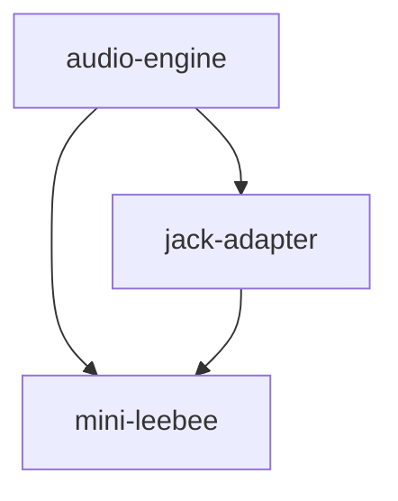

# Mini LeeBee

Small sequencer aimed for the Raspberry Pi.

## Building

```shell
cargo build --release
target/release/mini-leebee
```

## Testing

```shell
cargo test
```

## Packages


```mermaid
graph TD
  audio-engine --> jack-adapter

  audio-engine --> mini-leebee
  jack-adapter --> mini-leebee
```
