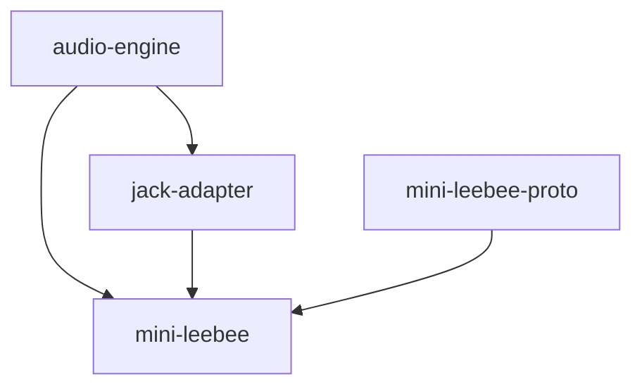

# Mini LeeBee

Small sequencer aimed for the Raspberry Pi.

## Interacting

Mini LeeBee is a gRPC server. One such way to interact with the gRPC server is
with [gRPC UI](https://github.com/fullstorydev/grpcui#installation).

```shell
grpcui -plaintext localhost:21894
```

## Building

```shell
cargo build --release
target/release/mini-leebee
```

## Running

```shell
cargo run --release
```

## Testing

```shell
cargo test
```

## Profiling

Profiling can be done with [Cargo Flamegraph](https://github.com/flamegraph-rs/flamegraph).

```
cargo flamegraph
```

## Packages


